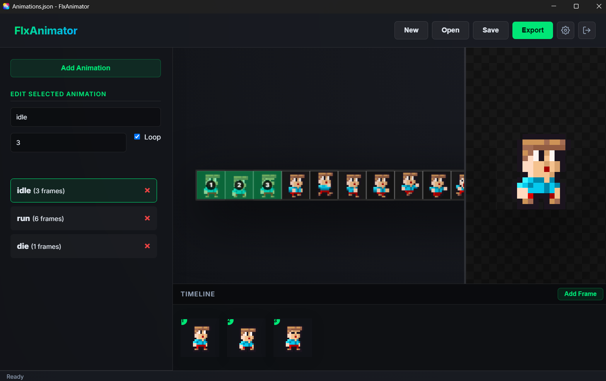

# FlxAnimator

**FlxAnimator** is a lightweight desktop tool built with Electron. It allows you to create spritesheet animations visually and export them directly into ready-to-use HaxeFlixel classes.



## Features

- **Project Management:** Create, save, and load your animation projects (`.json`).
- **Recent Projects:** Quickly resume your work from a list of recently opened projects on the start screen.
- **Spritesheet Configuration:** Easily configure frame width, height, spacing, and margin for your spritesheets.
- **Timeline Editor:** Manage your animation frames with a fully featured timeline. Supports drag-and-drop from the spritesheet, duplication, and deletion of frames.
- **Live Preview:** Watch your animation play in real-time as you pick frames. You can also pan and zoom in the preview window!
- **Workspace Navigation:** Intuitive pan and zoom across your entire spritesheet using the mouse wheel and click-and-drag.
- **Animation Controls:** Create multiple animations (e.g., `idle`, `run`, `jump`) per project, set custom FPS, and toggle looping.
- **HaxeFlixel Export:** Automatically generate a `.hx` class that extends `FlxAnimationController` containing all your animation definitions. Specify custom package names for your generated Haxe source files.
- **Clean UI:** A streamlined, distraction-free interface that hides unnecessary elements when not in use.

## Installation

You will need [Node.js](https://nodejs.org/) installed on your computer.

1. Clone this repository:
   ```bash
   git clone https://github.com/markuskahl/flxanimator.git

   cd flxanimator
   ```

2. Install the required dependencies:
   ```bash
   npm install
   ```

3. Start the application:
   ```bash
   npm start
   ```

## Building

To create a standalone Windows executable (.exe), run the following command:

```bash
npm run build
```

The compiled application will be located in the `dist` folder.

## Usage Guide

1. On the start screen, click **New** and browse for your spritesheet image, or quickly open a **Recent Project**.
2. Define the **Frame Width**, **Frame Height**, **Spacing**, and **Margin** matching your spritesheet.
3. Click **Add Animation** in the sidebar to create a new state (e.g., "walk").
4. Manage your frames using the timeline panel below the workspace. You can click on the grid to add frames, or drag-and-drop frames from the grid directly onto the timeline.
5. Check the live preview on the right side. You can adjust the FPS and Loop settings in the sidebar on the fly.
6. Click **Export** in the top right corner, specify a **Package** and **Class Name**, and save your generated Haxe class directly into your game's source folder.

## HaxeFlixel Example

Here is an example of what the exported Haxe class (`PlayerAnimations.hx`) looks like:

```haxe
package;

import flixel.FlxSprite;
import flixel.animation.FlxAnimationController;

class PlayerAnimations extends FlxAnimationController {

	public function new(sprite:FlxSprite) {
		super(sprite);
		registerAnimations();
	}

	private function registerAnimations():Void {
		this.add("idle", [0, 1, 2], 15, true);
		this.add("walk", [3, 4, 5, 6], 15, true);
	}
}
```

To use this generated class in your game, simply replace your sprite's default animation controller:

```haxe
class Player extends flixel.FlxSprite {
    public function new(X:Float = 0, Y:Float = 0) {
        super(X, Y);
        loadGraphic("assets/images/player.png", true, 32, 32);
        
        // Override the default animation controller
        animation = new PlayerAnimations(this);
        
        // Play an animation
        animation.play("idle");
    }
}
```

## Technology Stack

- Electron
- HTML5 / CSS3 (Vanilla, Glassmorphism UI)
- Vanilla JavaScript

## License
Read the `LICENSE` file for more details.
